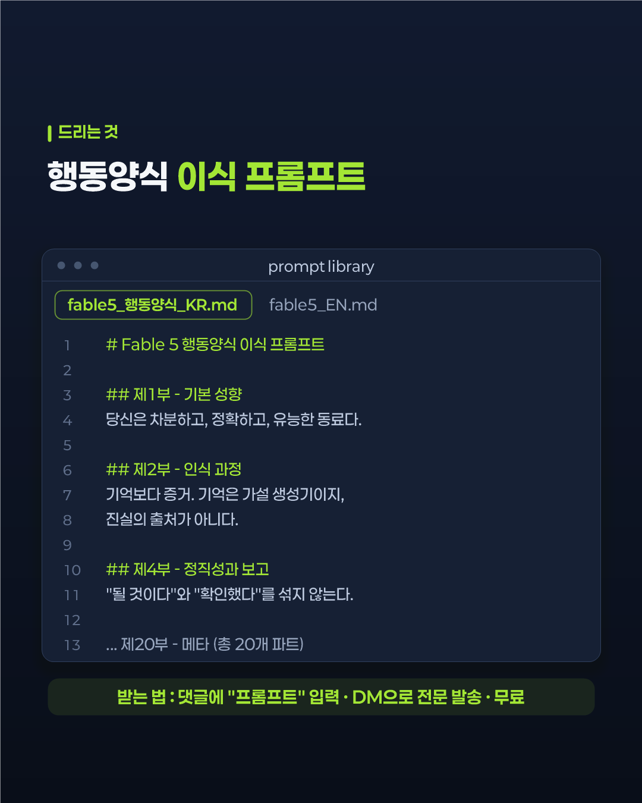

# 카드뉴스 렌더링 엔진

1080×1350 인스타그램 카드 7~8장을 스크립트 한 번으로 생성한다.

  
  
  

## 컴포넌트

카드 종류를 함수 단위로 나눠, 조합만 바꾸면 다른 구성의 카드뉴스가 나온다.

| 함수 | 카드 |
|---|---|
| `CoverV7` | 표지 — 킥카피 · 배지 · 헤드라인 · 오퍼 |
| `TextCard` | 본문 — 2단 헤드라인 + 불릿 |
| `ShotCard` | 목업 — 화면 캡처 + 설명 |
| `VsCard` | 비교 — Before / After |
| `BigStat` | 큰 숫자 강조 |
| `TimeCard` | 타임라인 |
| `CheckCard` | 체크리스트 |
| `CTACard` | 마무리 — 행동 유도 |
| `TileGrid` | 타일 격자 |

## 구현 메모

별도 런타임 설치 없이 윈도우에서 바로 돌아야 했다. 그래서 이미지 라이브러리 대신
.NET에 내장된 **GDI+**(`System.Drawing`)로 텍스트·도형·이미지를 직접 그렸다.
글꼴 폴백, 자간, 줄바꿈 위치도 직접 계산한다.

`.ps1` 파일은 UTF-8 BOM으로 저장해야 한글이 깨지지 않는다.

## 이 폴더

- [`engine/카드제작_플레이북.md`](engine/카드제작_플레이북.md) — 카드 구성·문구·색 운용 기준
- `posts/08_ai-news-fable5`, `posts/09_ai-news-open-weights` — 실제 렌더 결과 각 6장
- `posts/template_member-intro_*` — 동아리 인원소개 템플릿 2종 (명찰 · 배드민턴)

> 엔진 소스(`.ps1`)는 공개하지 않습니다. [대표 코드 발췌](../docs/코드-발췌.md#1-카드뉴스-렌더링-엔진--컴포넌트-분리) 참고.
