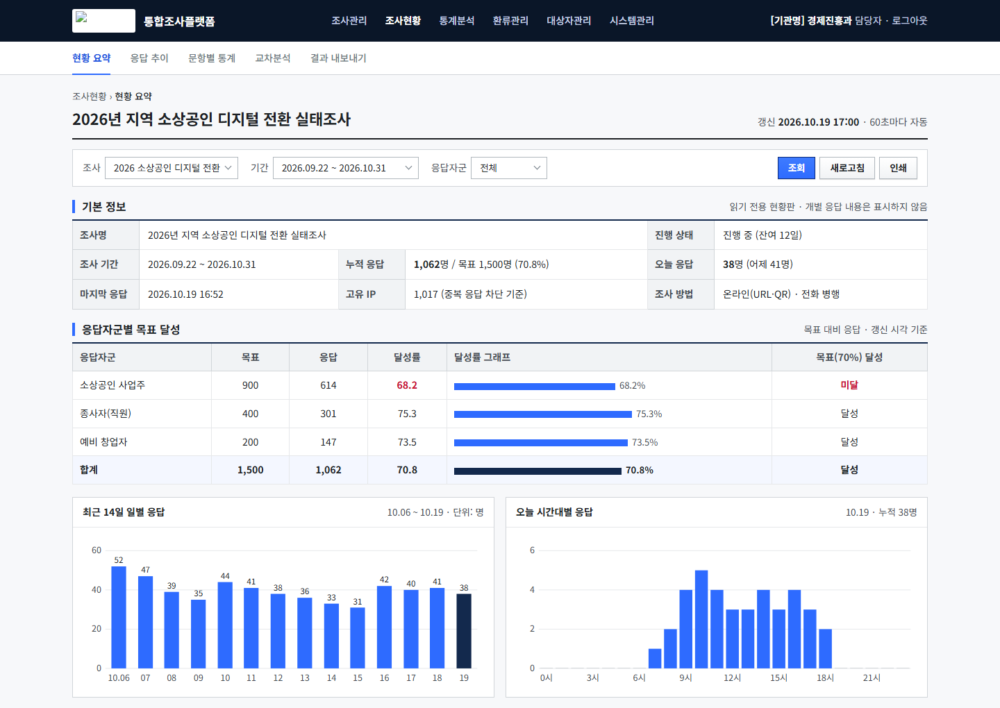

# 조사 현황 대시보드 시안

행정 디지털 표준(KRDS) 톤에 맞춘 대시보드 화면 시안.
격자 통계표와 바 차트로 조사 진행 현황을 한 화면에 담았다.

  
  

  

대학 조사용 · 지자체 조사용 · 다크 테마 대안. 기관명·조사명은 모두 가상 값으로 치환했다.

**정적 시안이라 소스를 그대로 두었다.** 브라우저로 `01_dashboard.html`을 열면 바로 보인다.

| 파일 | 내용 |
|---|---|
| `01_dashboard.html` | 기본 시안 |
| `company/01_dashboard.html` | 기관 적용안 |
| `variant-b/01_dashboard.html` | 색·밀도 대안 |
| `css/svy.css` | 공통 스타일 |

글꼴은 Pretendard, 색과 여백은 KRDS 가이드 값을 따랐다.
