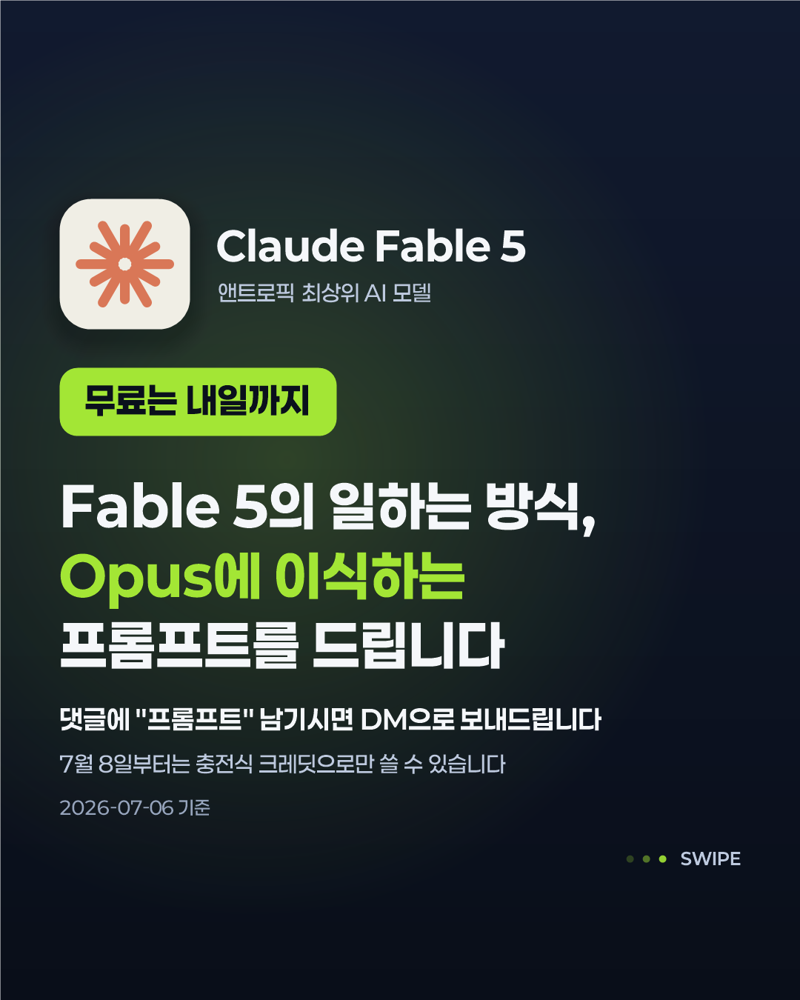
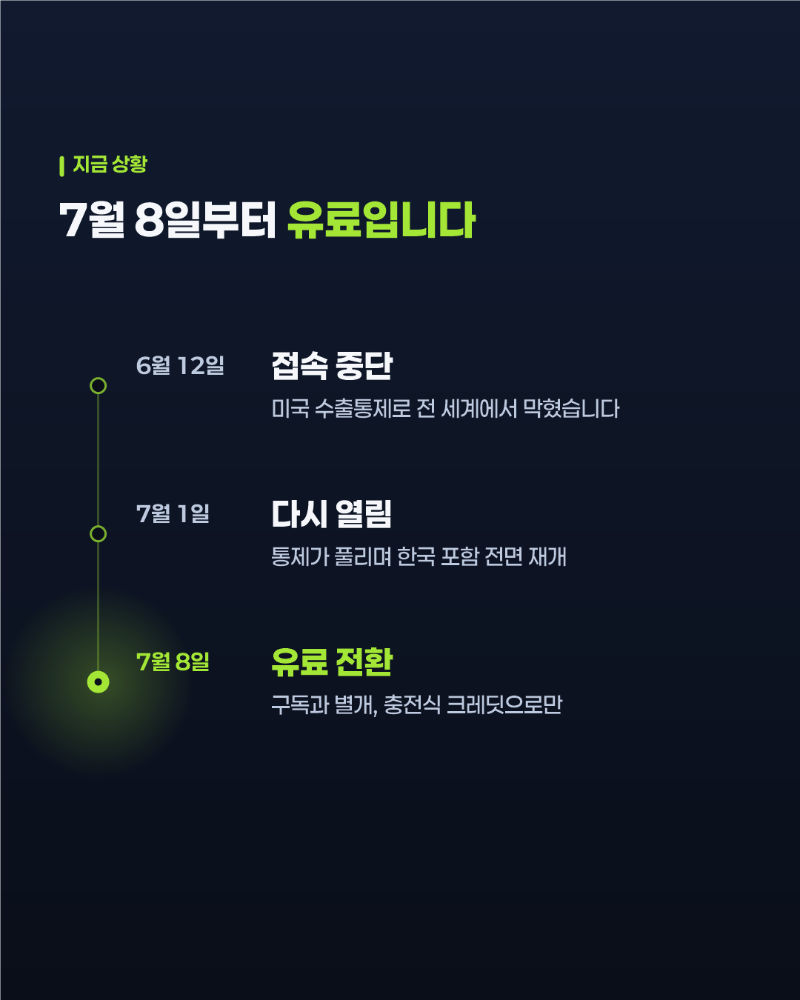
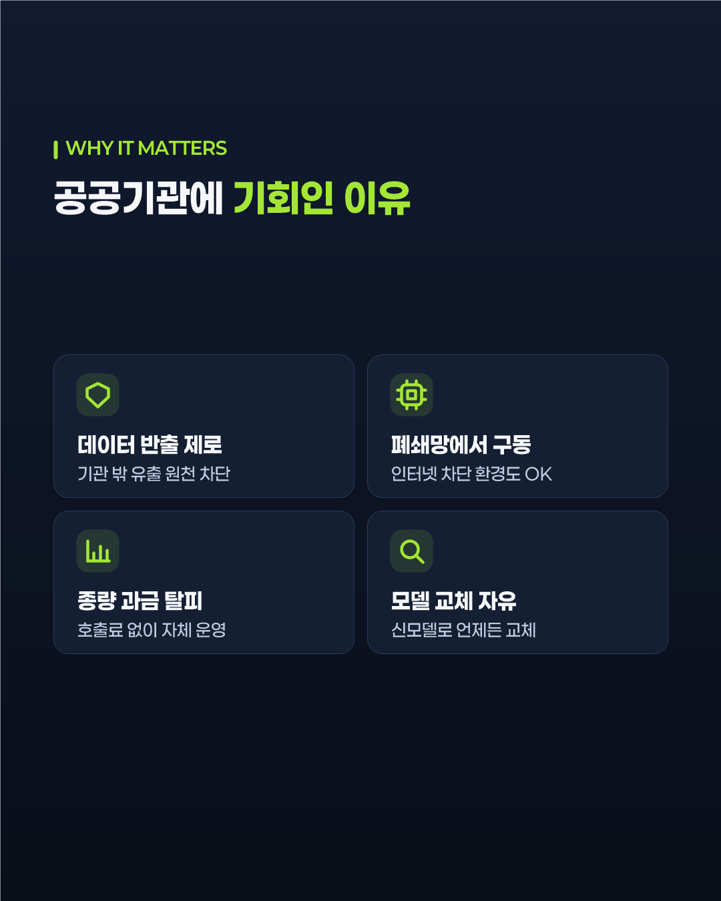
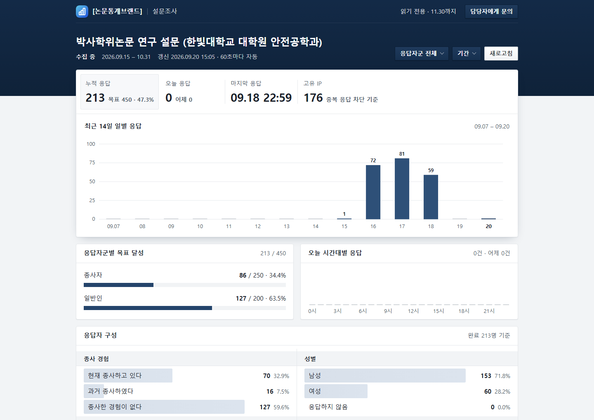
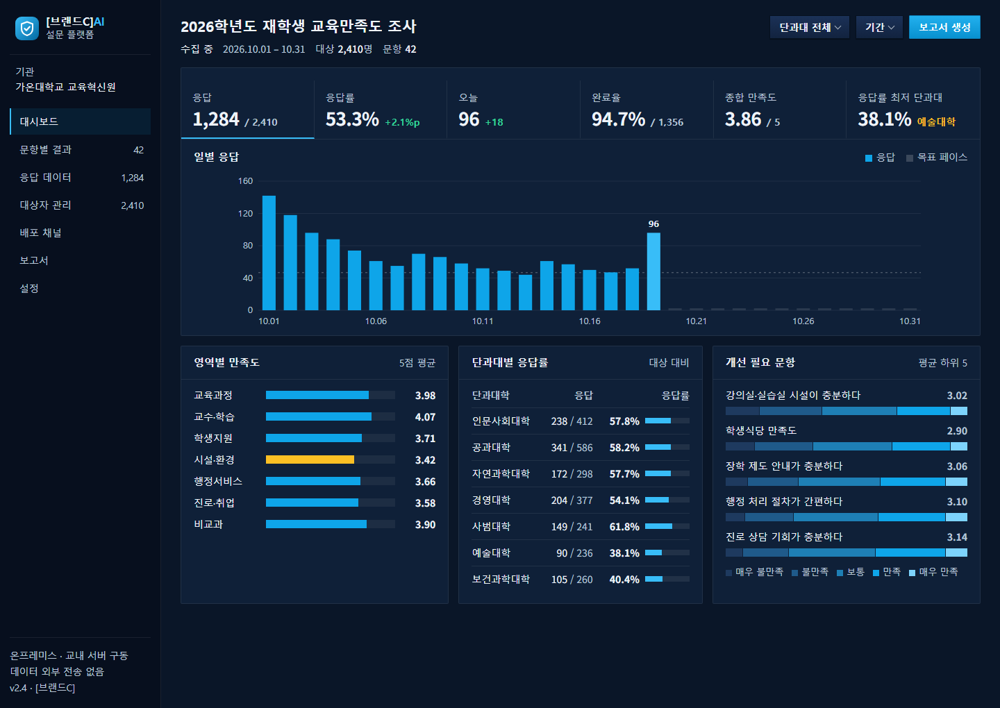
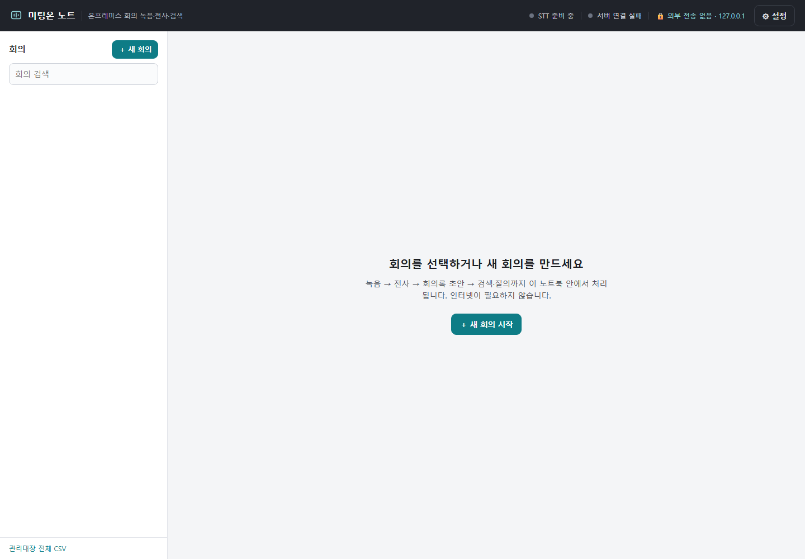

<h1 align="center">Portfolio</h1>

<p align="center">
  실무에서 설계·개발·운영한 프로젝트의 <b>설계 문서와 결과물</b>
</p>

<p align="center">
  
  
  
  
  
  
  
  
</p>

<p align="center">
  <a href="#-프로젝트">프로젝트</a> ·
  <a href="docs/코드-발췌.md">코드 발췌</a> ·
  <a href="#-무엇이-들어-있고-무엇이-없나">저장소 구성</a>
</p>

> [!IMPORTANT]
> **전체 소스는 공개하지 않습니다.** 업무로 작성한 코드라 설계 문서·화면·결과물과 대표 코드 발췌만 두었습니다.
> 구현을 확인하셔야 한다면 [`docs/코드-발췌.md`](docs/코드-발췌.md)를 보시거나 개별적으로 요청해 주세요.
>
> 회사·고객·개인 식별 정보(사명, 도메인, 담당자, 연락처, 서버 주소, 계정)는
> `[회사명]` · `company-main.example.com` · `user@example.com` · `***REDACTED***` 로 모두 치환했습니다.

<br>

## 🗂 프로젝트

<br>

### 🎨 카드뉴스 렌더링 엔진

<p align="center">
  
  
  
</p>
<p align="center"><sub>표지 · 본문 · BigStat 카드. 셋 다 스크립트 한 번으로 나온 결과물이다.</sub></p>

디자인 툴로 매번 손으로 만들던 1080×1350 카드뉴스를, **글과 데이터만 넣으면 7~8장이 한 번에 나오도록** 코드로 바꿨다.
카드 종류를 함수 단위 컴포넌트로 나눠 조합만 바꾸면 다른 구성이 만들어진다 — 표지 · 목업 · 타임라인 · BigStat · VS · 체크리스트 · CTA.

별도 런타임 설치 없이 윈도우에서 바로 돌아야 했기 때문에, 이미지 라이브러리 대신 .NET에 내장된 **GDI+로 텍스트·도형·이미지를 직접 그렸다.**

`PowerShell 5.1` `System.Drawing (GDI+)` `Python Pillow`
📁 [`01_insta-card-engine`](01_insta-card-engine) — 렌더 결과 49장, 제작 플레이북

<br>

### 🌐 기업 홈페이지 · 자체 PHP MVC 프레임워크

프레임워크 없이 **코어부터 직접 만들어** 구축하고 운영 중인 사이트 4종.
뉴스 · 증서 갤러리 · 문의폼 · 관리자 페이지를 갖췄고, 배포는 Paramiko 스크립트로 자동화했다.

```php
// 요청당 커넥션 하나, 예외 모드와 진짜 프리페어드 스테이트먼트를 기본값으로 강제
PDO::ATTR_ERRMODE            => PDO::ERRMODE_EXCEPTION,
PDO::ATTR_DEFAULT_FETCH_MODE => PDO::FETCH_ASSOC,
PDO::ATTR_EMULATE_PREPARES   => false,   // 꺼야 DB가 쿼리와 값을 분리해 처리한다
```

`PHP 8` `MySQL (PDO)` `Tailwind` `Paramiko`
📁 [`02_web-sites-php`](02_web-sites-php) — 작업 로그, 체크리스트, SEO 등록 가이드

<br>

### 📋 온라인 설문 시스템

문항 렌더링부터 응답 수집 · 집계 · **SPSS `.sav` 내보내기**까지. 중복 응답을 차단하고, 매일 아침 집계 리포트를 메일로 보낸다.
통계 담당자가 결과를 받아 바로 분석 도구에 올릴 수 있도록 `pyreadstat`으로 변환 단계를 붙였다.

`PHP` `MySQL` `Python (pyreadstat)` `cron`
📁 [`03_survey-system-php`](03_survey-system-php) — 배포 문서

<br>

### ⚙️ 설문 생성 자동화

수십 문항짜리 설문을 관리 화면에서 하나씩 만들던 작업을, **문항 정의만 적으면 되도록** 바꿨다.

```python
sb = SurveyBuilder(token="***REDACTED***")
sb.create_survey(title="테스트 설문", nickname="test_v1")
sb.add_single("성별을 선택해 주세요", ["남성", "여성", "기타"])
sb.add_matrix("만족도 평가", rows=["품질", "가격", "서비스"], choices=LIKERT5)
```

만족도·중요도를 동시에 묻는 IPA 문항은 API가 2차원 매트릭스를 지원하지 않아, 같은 항목으로 매트릭스를 두 번 만들어 이어 붙이는 방식으로 우회했다.

`Python` `SurveyMonkey REST API`
📁 [`03_survey-automation-surveymonkey`](03_survey-automation-surveymonkey) — 설계 문서, 사용 예시 3종

<br>

### 🏛 대학 교육수요자 만족도 통합조사 플랫폼

<p align="center">
  
  
  
</p>
<p align="center"><sub>행정 디지털 표준(KRDS) 톤에 맞춰 직접 그린 일러스트 — 로그인 · 완료 · 빈 상태</sub></p>

전자정부 표준 프레임워크 기반 조사 플랫폼. 골격 구현과 함께 **데이터 모델 · 환류관리 · 요구사항 대응표 설계 문서 9종**을 작성했다.

설계의 핵심은 **보고서에서 끝나던 IPA를 시스템에서 순환시킨 것**이다.
중점개선 항목 → 과제 등록 → 개선계획(Plan) → 실행(Do) → 차년도 이행점검(Check) → 달성/이월(Act)로 이어지고, 연도가 서로 연결된다.

`Java 17` `Spring / eGovFrame 4.x` `MyBatis` `Oracle` `JSP` `KRDS`
📁 [`03_survey-platform-egovframe`](03_survey-platform-egovframe) — 설계 문서 9종, 일러스트 시안 107점

<br>

### 📊 조사 현황 대시보드 시안

<p align="center">
  
  
</p>
<p align="center"><sub>대학 조사용(라이트) · 다크 테마 대안. 기관명·조사명은 가상 값</sub></p>

행정 표준 톤의 격자 통계표와 바 차트 화면 시안. **정적 시안이라 소스를 그대로 두었다.**

`HTML` `CSS` `Pretendard`
📁 [`03_survey-dashboard-design-krds`](03_survey-dashboard-design-krds)

<br>

### 🎙 회의록 AI

녹음 파일을 받아쓰고 화자를 나눈 뒤 회의록으로 정리하고, 그 내용에 **질문까지 할 수 있는** 도구.
회의 내용이 외부 API로 나가면 안 된다는 요구사항이 있어 **전 과정을 로컬에서** 돌린다.

<p align="center">
  
</p>
<p align="center"><sub>상단 우측에 <b>외부 전송 없음 · 127.0.0.1</b> 상태를 항상 띄워, 녹음이 밖으로 나가지 않는다는 것을 쓰는 사람이 확인할 수 있게 했다.</sub></p>

```
녹음 파일 ─→ Whisper STT ─→ 화자 분리 ─→ 로컬 LLM 회의록
                                              │
                                        bge 임베딩 ─→ RAG 질의응답
```

조각을 나눌 때 **발화 구간 경계를 살리고 앞뒤를 겹치게** 했다. 고정 길이로 자르면 문장 중간이 끊겨 검색 품질이 떨어진다.
답변에는 몇 분 몇 초 구간인지 함께 돌려줘, 사용자가 원본 녹음에서 바로 확인할 수 있다.

`faster-whisper` `Ollama` `bge 임베딩` `SQLite` `FastAPI / PHP`
📁 [`04_meeting-minutes-ai`](04_meeting-minutes-ai) — 설계서, 시연 대본. Python 단일 앱 / PHP 웹 + Python 워커 두 구현체

<br>

### 🔮 사주 SaaS

만세력 계산 엔진을 **독립 마이크로서비스로 분리해** 다른 제품에서도 호출할 수 있게 하고, 결제·인증 코어 API를 붙였다.

계산 기준이 태어난 *시각*이라 시간대 처리가 결과를 바꾼다. 한국은 표준시 자오선이 네 번 바뀌었고 서머타임도 있었는데, 이걸 무시하면 시주(時柱)가 통째로 틀린다.

```python
if date < datetime.date(1908, 4, 1):  return 127.5   # 표준시 도입 전
if date < datetime.date(1912, 1, 1):  return 127.5   # 대한제국 UTC+8:30
if date < datetime.date(1954, 3, 21): return 135.0   # UTC+9
if date < datetime.date(1961, 8, 10): return 127.5   # UTC+8:30
return 135.0                                          # 현행 KST
```

로컬 LLM을 해석 생성에 쓰기 위해 EXAONE · Gemma · Qwen을 같은 조건으로 비교 평가했다.

`Python FastAPI` `JWT` `SQLite` `PHP` `Ollama` `Stable Diffusion`
📁 [`05_saju-service`](05_saju-service) — 기술 아키텍처, 기획 문서, 모델 비교 실험

<br>

### 🧰 업무 문서 도구

반복 작업을 줄이려고 그때그때 만든 것들 — HWP 텍스트 추출기(`olefile`), Markdown→PDF 변환기(`weasyprint`), **LLM 행동양식 이식 프롬프트(한/영)**.

`Python`
📁 [`06_doc-tools`](06_doc-tools)

<br>

---

## 📦 무엇이 들어 있고, 무엇이 없나

<table>
<tr><th align="left">있는 것</th><th align="left">없는 것</th></tr>
<tr valign="top"><td>

- 설계 문서 36종<br>
  <sub>데이터 모델 · 환류관리 상세설계 · 요구사항 대응표 · 화면 목록 · 시연 대본</sub>
- 카드뉴스 렌더 결과 60장
- 일러스트 시안 SVG 107점
- 정적 화면 시안 (KRDS 대시보드) + 렌더 화면 4장
- [대표 코드 발췌 6종](docs/코드-발췌.md)

</td><td>

- 실행 가능한 애플리케이션 소스<br>
  <sub>PHP · Python · Java · PowerShell 구현부</sub>
- DB 스키마 덤프와 시드 데이터
- 실제 고객 데이터
- 모델 가중치
- 운영 설정 · 자격 증명

</td></tr>
</table>

<br>

<p align="center">
  <sub><a href="https://github.com/yes-moon">github.com/yes-moon</a></sub>
</p>
